# 🤖 RAG Documentation Navigator

[](https://www.python.org/)
[](https://aws.amazon.com/lambda/)
[](LICENSE)
[](https://github.com/andresafmc/rag-documentation-navigator)

Intelligent document navigator using Generative AI on AWS to provide fast, accurate answers from a private knowledge base with API key authentication.

## Live Demo

🔗 **[View Demo](https://andres-rag-document-navigator-demo.s3.eu-central-1.amazonaws.com/index.html)**

Experience real-time RAG technology with our live demonstration powered by AWS Bedrock and optimized vector search. **Demo requires API key** - contact [@andres-fmc](https://www.linkedin.com/in/andres-fmc/) for access.

## Problem Statement

Organizations accumulate vast amounts of technical documentation, policy documents, and knowledge bases that become increasingly difficult to navigate as they grow. Finding specific information across hundreds of PDFs is time-consuming and often results in incomplete answers or missed critical details. Traditional search tools lack context understanding and fail to synthesize information from multiple sources.

## Solution

A serverless RAG (Retrieval-Augmented Generation) system with API key protection that transforms static document collections into an intelligent knowledge navigator:

1. **Upload** PDF documents to build your knowledge base
2. **Authenticate** with secure API key
3. **Ask** questions in natural language
4. **Receive** contextual answers with source citations in seconds

The system understands context, synthesizes information from multiple sources, and provides accurate answers backed by specific document references while maintaining secure access control.

## Architecture

```mermaid
graph TB
    A[📄 PDF Documents] -->|Index Building| B[Document Processor]
    B --> C[Text Chunking]
    C --> D[Amazon Titan Embeddings]
    D --> E[Compressed Vector Index]
    E -->|Store| F[S3 Bucket]
    
    G[User Query] --> H[🔐 API Key Validation]
    H --> I[API Gateway]
    I --> J[Lambda Function]
    J -->|Load Index| F
    J -->|Generate Query Embedding| K[Bedrock - Titan]
    J -->|Vector Search| L[Cosine Similarity]
    L -->|Relevant Chunks| M[Context Assembly]
    M --> N[Bedrock - Claude 3 Sonnet]
    N -->|Contextual Answer| O[Web Interface]
```



### Technical Components

| Service | Purpose | Configuration |
|---------|---------|--------------|
| **S3** | Vector index storage | Compressed JSON (32MB vs 99MB FAISS) |
| **Lambda** | Query processing | Python 3.12, 1GB RAM, 60s timeout |
| **API Gateway** | REST endpoint | CORS enabled, API key validation |
| **Bedrock Titan** | Text embeddings | amazon.titan-embed-text-v1 (1536 dims) |
| **Bedrock Claude** | Answer generation | Claude 3 Sonnet for context synthesis |
| **Authentication** | API key protection | Environment variable validation |

## Key Features

- **Lightning Fast**: <5 second response times with optimized vector search
- **Secure Access**: API key authentication with rate limiting
- **Cost Effective**: 95% smaller index than traditional FAISS solutions
- **Accurate Citations**: Every answer includes source document references
- **Scalable**: Processes 8,211 document chunks efficiently
- **Protected**: Private knowledge base with controlled access
- **EU Compliant**: Deployed in eu-central-1 region

## Installation & Deployment

### Prerequisites

- AWS Account with Bedrock access
- Python 3.12+
- AWS CLI configured
- PDF documents for your knowledge base

### 1. Clone Repository

```bash
git clone https://github.com/andresafmc/rag-documentation-navigator.git
cd rag-documentation-navigator
```

### 2. Set Up Environment

```bash
python3 -m venv .venv
source .venv/bin/activate  # Windows: .venv\Scripts\activate
pip install -r requirements.txt
```

### 3. Configure Environment

Create `.env` file:
```bash
S3_BUCKET_NAME=your-index-bucket-name
```

### 4. Prepare Your Documents

```bash
# Create data directory and add your PDFs
mkdir data
# Copy your PDF files to ./data/
cp /path/to/your/documents/*.pdf ./data/
```

### 5. Build Knowledge Base Index

```bash
python build_index.py
```

This process will:
- Extract text from all PDFs in `./data/`
- Split content into optimized chunks (1000 chars, 100 overlap)
- Generate embeddings using Amazon Titan
- Create compressed vector index
- Upload to S3 (from ~99MB FAISS to ~32MB compressed JSON)

### 6. Deploy Lambda Function

#### 6.1 Create S3 Buckets
- Index storage: `your-index-bucket-name`
- Frontend hosting: `your-frontend-bucket-name`

#### 6.2 Create IAM Role with Required Permissions
```json
{
    "Version": "2012-10-17",
    "Statement": [
        {
            "Effect": "Allow",
            "Action": [
                "s3:GetObject"
            ],
            "Resource": "arn:aws:s3:::your-index-bucket-name/*"
        },
        {
            "Effect": "Allow",
            "Action": [
                "bedrock:InvokeModel"
            ],
            "Resource": "*"
        }
    ]
}
```

#### 6.3 Deploy Function and Configure API Gateway

**Create Lambda Function:**
1. Go to AWS Lambda Console
2. Create function `RAG-Doc-Navigator-Clean`
3. Set runtime to Python 3.12
4. Configure environment variables:
   - `S3_BUCKET_NAME`: your-index-bucket-name
   - `VALID_API_KEY`: your-chosen-api-key
5. Upload function code from `lambda_function/app.py`

**Create API Gateway:**
1. Create REST API named `rag-documentation-api`
2. Create resource `/query`
3. Add POST method with Lambda proxy integration
4. Enable CORS
5. Deploy to `prod` stage

### 7. Deploy Frontend

```bash
# Update frontend with your API endpoint
aws s3 cp frontend/index.html s3://your-frontend-bucket/ --region eu-central-1
```

## API Usage

### Authentication

All API requests require a valid API key in the header:

```bash
x-api-key: your-api-key-here
```

### Endpoint
```
POST https://your-api-id.execute-api.eu-central-1.amazonaws.com/prod/query
```

### Request
```json
{
    "question": "What are the main benefits of RAG architecture?"
}
```

### Response
```json
{
    "answer": "RAG architecture provides several key benefits: 1) Combines retrieval with generation for factual accuracy, 2) Reduces hallucinations by grounding responses in source documents, 3) Enables dynamic knowledge updates without retraining...",
    "sources": ["rag-paper-neurips.pdf", "aws-bedrock-guide.pdf"],
    "chunks_used": 5,
    "model_used": "Claude 3 Sonnet (Clean)",
    "status": "success"
}
```

### Example with cURL
```bash
curl -X POST \
  -H "Content-Type: application/json" \
  -H "x-api-key: your-api-key" \
  -d '{"question": "How does vector similarity search work in RAG systems?"}' \
  https://your-api-url/prod/query
```

### Error Responses

**Unauthorized (401):**
```json
{
    "error": "Unauthorized",
    "message": "Valid API key required. Contact @andres-fmc for access."
}
```

**Rate Limited:**
Frontend implements client-side rate limiting (5 requests per session) to prevent abuse.

## Project Structure

```
rag-documentation-navigator/
├── frontend/
│   └── index.html              # Protected web interface
├── lambda_function/
│   └── app.py                  # Main Lambda function with auth
├── data/                       # PDF documents (not in repo)
├── local_index/               # Generated index files
├── build_index.py             # Index creation script
├── requirements.txt           # Python dependencies
├── .env                       # Environment variables (not in repo)
├── LICENSE                    # MIT License
└── README.md                  # This file
```

## Configuration & Customization

### API Key Management

**Set API Key in Lambda:**
1. Go to Lambda function configuration
2. Environment variables section
3. Add `VALID_API_KEY` with your chosen key

**Frontend Rate Limiting:**
```javascript
// In frontend/index.html
const MAX_REQUESTS_PER_SESSION = 5;
```

### Index Building Parameters
```python
# In build_index.py
text_splitter = RecursiveCharacterTextSplitter(
    chunk_size=1000,           # Optimal for Claude 3 context
    chunk_overlap=100,         # Maintains continuity
    separators=["\n\n", "\n", ".", " ", ""]
)
```

### Lambda Environment Variables
```bash
S3_BUCKET_NAME=your-index-bucket-name
VALID_API_KEY=your-secure-api-key
```

## Performance Metrics

| Metric | Value | Monitoring |
|--------|-------|------------|
| Average response time | <5 seconds | Real-time tracking |
| Vector search accuracy | >95% relevance | Manual validation |
| Index compression ratio | 68% smaller than FAISS | Storage optimization |
| Concurrent queries | 1000 simultaneous | AWS Lambda scaling |
| Cost per query | $0.002-0.004 | Live cost tracking |
| Cold start time | <3 seconds | CloudWatch metrics |

### Security Features
- **API Key Validation**: All requests authenticated
- **Rate Limiting**: 5 queries per session (frontend)
- **CORS Protection**: Configured for specific origins
- **Error Handling**: No sensitive information in error messages

### Cost Analysis (per query)
- **Base cost**: $0.002-0.004/query
- **Breakdown**:
  - Embeddings: $0.0003/query (15%)
  - Claude 3 inference: $0.002-0.003/query (80%)
  - Infrastructure: <$0.0001/query (5%)

**Examples:**
- 100 queries/day: ~$0.30/day
- 1,000 queries/month: ~$3.00/month
- Enterprise usage (10k queries): ~$30/month

## Local Testing

### Test Index Building
```bash
# Ensure PDFs are in ./data/ directory
python build_index.py
```

### Test API with Authentication
```bash
# Test without API key (should fail)
curl -X POST https://your-api-url/prod/query \
  -H 'Content-Type: application/json' \
  -d '{"question": "test"}'

# Test with valid API key (should succeed)
curl -X POST https://your-api-url/prod/query \
  -H 'Content-Type: application/json' \
  -H 'x-api-key: your-api-key' \
  -d '{"question": "What is RAG?"}'
```

## Troubleshooting

### Authentication Issues
- **401 Unauthorized**: Check API key is correctly set in Lambda environment variables
- **Invalid API key**: Verify the key matches exactly (case-sensitive)
- **Missing header**: Ensure `x-api-key` header is included in requests

### Index Building Issues
- **Error: "No documents found"**: Verify PDFs are in `./data/` directory
- **Embedding failures**: Check AWS credentials and Bedrock access
- **Memory errors**: Reduce `chunk_size` or process fewer documents

### Lambda Deployment Issues
- **Import errors**: Verify all dependencies in `requirements.txt`
- **Permission denied**: Check IAM role has S3 and Bedrock permissions
- **Timeout errors**: Current configuration uses 60s timeout and 1GB RAM

### Query Performance Issues
- **Slow responses**: Check index is properly cached in Lambda
- **Poor relevance**: Adjust chunk size or overlap parameters
- **CORS errors**: Verify API Gateway CORS configuration

## Security Best Practices

### API Key Management
- Use strong, unique API keys
- Rotate keys regularly
- Monitor usage through CloudWatch logs
- Implement different keys for different use cases

### Access Control
- Configure API Gateway with proper CORS settings
- Use IAM roles with minimal required permissions
- Monitor failed authentication attempts
- Implement IP whitelisting if needed

## Knowledge Base Management

### Adding New Documents
```bash
# Add PDFs to data directory
cp new-documents/*.pdf ./data/

# Rebuild index
python build_index.py

# Deploy updated function if needed
```

### Supported Document Types
- **PDF**: Primary support with metadata extraction
- **TXT**: Plain text documents
- **Future**: DOCX, HTML support planned

### Current Knowledge Base
- **8,211 document chunks** indexed
- **32MB compressed index** (vs 99MB traditional FAISS)
- **Documents included**: AWS Well-Architected Framework, RAG research papers, Amazon Bedrock documentation

## Business Impact

This solution addresses critical enterprise challenges:

- **Knowledge Discovery**: Reduce document search time from hours to seconds
- **Security**: API key authentication prevents unauthorized access
- **Compliance**: Ensure answers are grounded in official documentation
- **Cost Control**: Rate limiting and authentication prevent abuse
- **Scalability**: Serverless architecture scales with demand

## Technical Decisions

**Why API Key Authentication?**
- Simple to implement and manage
- Prevents unauthorized usage and cost escalation
- Allows usage tracking and analytics
- Portfolio demonstration with controlled access

**Why Custom Vector Search over Managed Solutions?**
- 95% cost reduction compared to managed vector databases
- Full control over indexing and retrieval algorithms
- Optimized for AWS Lambda cold starts
- Simple deployment without additional infrastructure

**Why Compressed JSON over FAISS?**
- 68% smaller storage footprint
- Faster Lambda cold starts (3s vs 8s)
- Easier debugging and inspection
- Native JSON parsing performance

**Why Claude 3 Sonnet over GPT?**
- Superior context synthesis from multiple sources
- Better instruction following for structured responses
- Reduced hallucination rates with source grounding
- Cost-effective for enterprise usage patterns

## 🤝 Contributing

Contributions welcome! Please:

1. Fork the project
2. Create feature branch (`git checkout -b feature/NewCapability`)
3. Add comprehensive tests
4. Update documentation
5. Submit pull request

### Development Guidelines
- Follow AWS Well-Architected principles
- Maintain <5s response time targets
- Document all configuration changes
- Include cost impact analysis
- Test authentication flows

## 🔐 Demo Access

For live demonstration access:
- Contact [@andres-fmc](https://www.linkedin.com/in/andres-fmc/) on LinkedIn
- Temporary API keys available for evaluation
- Full documentation and setup guidance provided

---

⭐ If you find this project useful, please consider giving it a star on GitHub!